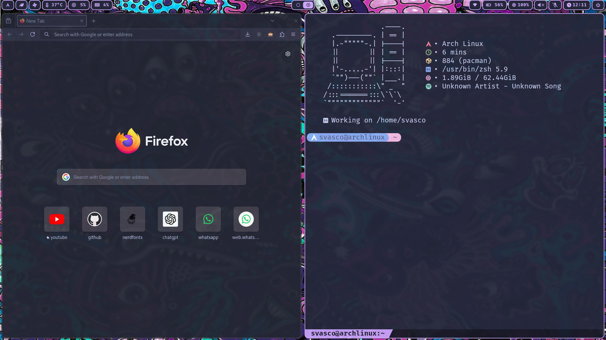
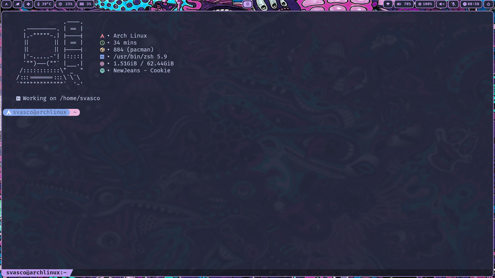
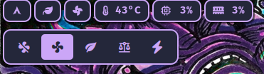
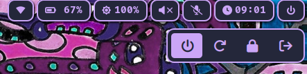
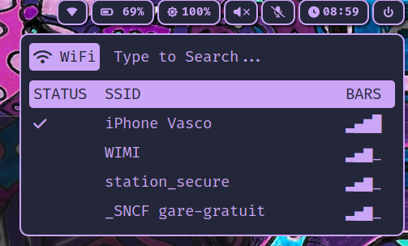

# Arch Linux x Hyprland Dotfiles

> *No hate please, this is my first ever Arch Linux x Hyprland rice. But I have been tweaking it for quite some time now.*
> *I decided to make these files publicly available to (maybe) get some feedback from experienced ricers. But also because I got tired of storing them in a USB Drive.*

## `🖼️` Preview :








## `📦` Requirements :
> 1. **Pacman :**
> ```bash
> sudo pacman -S firefox thunar gvfs lazygit fzf ripgrep pamixer unzip dotnet-runtime dotnet-sdk dunst wl-clipboard wev swww brightnessctl power-profiles-daemon ruby zsh hyprlock waybar neofetch nwg-look neovim curl git cliphist pavucontrol github-cli bluez bluez-utils blueman 
> ```
> ```bash
> sudo pacman -R dolphin 
> ```
> *+ remove dolphin config files*
> 
> 2. **AUR (Arch User Repository) :**
> *I use [YAY](https://github.com/Jguer/yay), but feel free to use any other AUR Helper.*
> ```bash
> yay -S grimblast webcord noto-fonts-cjk ttf-joypixels spotify-launcher oh-my-posh waypaper catppuccin-gtk-theme-mocha nbfc-linux
> ```
> 3. **Other Requirements :**
> - [ohmyzsh](https://ohmyz.sh/)
> - zsh-autosuggestions & zsh-syntax-highlighting plugins :
>   ```bash
>   git clone https://github.com/zsh-users/zsh-syntax-highlighting.git ${ZSH_CUSTOM:-~/.oh-my-zsh/custom}/plugins/zsh-syntax-highlighting
>   git clone https://github.com/zsh-users/zsh-autosuggestions ${ZSH_CUSTOM:-~/.oh-my-zsh/custom}/plugins/zsh-autosuggestions
>   ```
> - [colorls](https://github.com/athityakumar/colorls) :
>   ```bash
>   sudo gem install colorls
>   gem install colorls
>   ```
> - [asdf](https://asdf-vm.com/)
> - [node](https://nodejs.org/en) :
>   ```bash
>   asdf plugin add nodejs https://github.com/asdf-vm/asdf-nodejs.git
>   asdf install nodejs latest
>   ```
> - FiraCode Nerd Font :
>   ```bash
>   oh-my-posh font install FiraCode
>   ```
> 
> *These requirements are needed if you want an identical setup, feel free to install the ones you need and to edit the config files accordingly.*

## `📋` To-Do :
> - Replace every python script for rofi with bash or C scripts.
> - Improve the Fan Menu : add a tooltip, send notifications on mode change, add a custom mode (set fan speed manually).
> - Improve the WiFi Menu : manage IP address, mask, etc. + detect when using an ethernet connection and display a different menu if that is the case.
> - Replace waypaper with rofi.
> - Add an emoji picker rofi menu.
